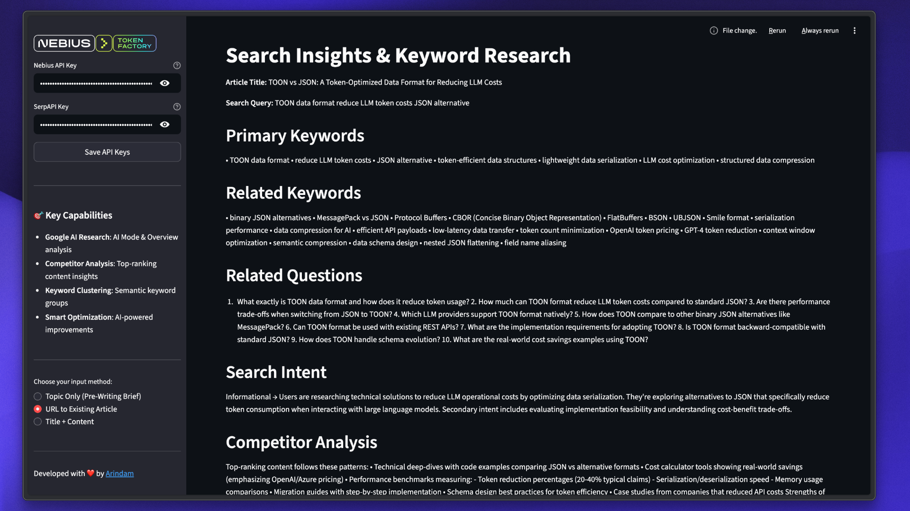

ERROR    Error calling Groq API: Error code: 400 - {'error': {'message': 'The model `llama-3.1-70b-versatile` has been decommissioned and is no longer supported. Please  
         refer to https://console.groq.com/docs/deprecations for a recommendation on which model to use instead.', 'type': 'invalid_request_error', 'code':
         'model_decommissioned'}}
ERROR    Non-retryable model provider error: {"error":{"message":"The model `llama-3.1-70b-versatile` has been decommissioned and is no longer supported. Please refer to 
         https://console.groq.com/docs/deprecations for a recommendation on which model to use instead.","type":"invalid_request_error","code":"model_decommissioned"}}   

ERROR    Error in Agent run: {"error":{"message":"The model `llama-3.1-70b-versatile` has been decommissioned and is no longer supported. Please refer to
         https://console.groq.com/docs/deprecations for a recommendation on which model to use instead.","type":"invalid_request_error","code":"model_decommissioned"}}   
# 🚀 ContentFlow - Professional SEO Content Optimization AI

> **AI-Powered Content Optimization Platform** — Transform your content strategy with intelligent SEO analysis, competitor insights, and AI-driven optimization recommendations.

[](https://python.org)
[](https://streamlit.io)
[](LICENSE)

---

## 📋 Overview

ContentFlow is an advanced AI-powered platform that helps content teams and SEO professionals optimize their content strategy through comprehensive keyword research, competitor analysis, and intelligent content recommendations.

**Two powerful modes:**
- 🎯 **Pre-Writing Brief** - Generate SEO strategy before you write
- ⚡ **Content Optimization** - Improve existing articles for better rankings

---

## ✨ Key Features

### 🔍 **Comprehensive Keyword Research**
- AI-powered keyword discovery and clustering
- Search volume and intent analysis
- Long-tail keyword opportunities
- Related questions and search patterns

### 📊 **Competitor Analysis**
- Analyze top-ranking content
- Identify ranking factors
- Content structure insights
- Benchmark against competitors

### 📋 **Content Audit & Recommendations**
- Gap analysis for existing content
- Optimization opportunities identification
- E-E-A-T signal assessment
- Actionable improvement suggestions

### ✏️ **AI-Powered Content Rewrites**
- Section-level optimization suggestions
- Natural keyword integration
- Improved readability and engagement
- SEO-friendly recommendations

### 🎯 **Google AI Search Ready**
- Optimized for Google AI Overview
- Answer-focused content strategies
- Attribution signal enhancement
- Visibility recommendations

### 🎨 **Professional Web Interface**
- Modern, intuitive Streamlit UI
- Real-time progress tracking
- Tab-based results display
- Clean, professional design

---

## 🎯 Use Cases

✅ Content creators planning new articles
✅ SEO professionals optimizing existing content
✅ Marketing teams analyzing competitors
✅ Content agencies managing multiple clients
✅ E-commerce teams improving product pages

---

## 📦 Prerequisites

- **Python 3.11+**
- **Groq API Key** (Free tier available at [console.groq.com](https://console.groq.com))
- **SerpAPI Key** (Get it from [serpapi.com](https://serpapi.com))
- 128MB free disk space

---

## ⚙️ Installation

### 1️⃣ Clone the Repository
```bash
git clone https://github.com/Tanishbelel/TextContent_Generation_model.git
cd content_team_agent
```

### 2️⃣ Create Virtual Environment
```bash
# Windows
python -m venv .venv
.\.venv\Scripts\Activate.ps1

# macOS/Linux
python3 -m venv .venv
source .venv/bin/activate
```

### 3️⃣ Install Dependencies
```bash
pip install -e .
```

### 4️⃣ Setup Environment Variables
Create `.env` file in the project root:
```env
GROQ_API_KEY=your_groq_api_key_here
SERPAPI_API_KEY=your_serpapi_key_here
```

✅ **Never commit `.env` file** — It's automatically in `.gitignore`

---

## 🚀 Quick Start

### Launch the Web App
```bash
streamlit run app.py
```

The app will open in your browser at `http://localhost:8501`

### 3 Easy Steps:

1. **Configure API Keys** (left sidebar)
2. **Choose Analysis Mode**:
   - 📝 Pre-Writing Brief
   - 🔗 Existing Article URL
   - ✏️ Title + Content
3. **Click "Generate Optimization Analysis"** and wait for results

---

## 📖 Usage Guide

### Mode 1: Pre-Writing Brief
Perfect for planning new content before you write.

```
Input: Your topic/keyword
Output:
├── Keyword research & clustering
├── Content structure & outline
├── FAQ opportunities
└── Writing guidelines
```

### Mode 2: Content Optimization
Improve existing articles for better rankings.

```
Input: Article URL or Title + Content
Output:
├── Search insights
├── Content audit
├── Optimization recommendations
└── Section-level rewrites
```

---

## 📊 Output Reports

ContentFlow generates comprehensive reports organized in tabs:

| Tab | Content | Use Case |
|-----|---------|----------|
| 🔍 Keywords | Keyword research, clustering, search intent | Planning strategy |
| 📊 Analysis | Content audit, gaps, opportunities | Identifying improvements |
| 📋 Brief | Content outline, structure, guidelines | Pre-writing preparation |
| ✏️ Rewrites | AI-optimized section rewrites | Direct optimization |

---

## 🎓 Examples

### Example 1: Pre-Writing Brief
```
Topic: "Advanced Python async programming"

Results:
✓ Primary keywords with search volume
✓ Semantic keyword clustering
✓ FAQ questions readers ask
✓ Recommended article structure
✓ Writing guidelines
```

### Example 2: Content Optimization
```
URL: https://example.com/python-async

Results:
✓ Current keyword coverage analysis
✓ Missing optimization opportunities
✓ Competitor comparison insights
✓ Rewritten sections with improvements
✓ E-E-A-T enhancement suggestions
```

---

## 🏗️ Architecture

```
ContentFlow
├── Frontend (Streamlit)
│   ├── Hero header & stats
│   ├── API configuration
│   └── Tab-based results
├── Workflow Engine (Agno)
│   ├── Keyword research
│   ├── Content analysis
│   ├── Competitor analysis
│   └── Content generation
└── APIs
    ├── Groq (AI Analysis)
    └── SerpAPI (Search Data)
```

---

## 🔧 Configuration

### Environment Variables
```env
GROQ_API_KEY=gsk_...           # Groq API key
SERPAPI_API_KEY=...            # SerpAPI key
```

### Customization
Edit `pyproject.toml` to add/remove dependencies or modify configuration.

---

## 📈 Performance Tips

- **Faster Analysis**: Use pre-write mode for new content (fewer dependencies)
- **Better Results**: Provide detailed, actual content for optimization mode
- **API Optimization**: Reuse session to avoid repeated authentication

---

## 🐛 Troubleshooting

### "API key not found"
```bash
# Check .env file exists
ls -la .env

# Verify variables are correct
cat .env
```

### "Model not supported"
Update your Groq model in code, or check [Groq documentation](https://console.groq.com/docs/models)

### "Connection timeout"
- Check internet connection
- Verify API keys are valid
- Try again with simpler input

---

## 📝 Project Structure

```
content_team_agent/
├── app.py                      # Main Streamlit app
├── main.py                     # Workflow definitions
├── tools.py                    # Tool implementations
├── pyproject.toml              # Dependencies & config
├── .env.example                # Example environment file
├── .gitignore                  # Git ignore rules
└── README.md                   # This file
```

---

## 🤝 Contributing

Contributions are welcome! Here's how:

1. Fork the repository
2. Create feature branch (`git checkout -b feature/amazing-feature`)
3. Commit changes (`git commit -m 'Add amazing feature'`)
4. Push to branch (`git push origin feature/amazing-feature`)
5. Open Pull Request

---

## 📜 License

This project is licensed under the MIT License - see the [LICENSE](LICENSE) file for details.

---

## 🙋 Support

- 📧 **Issues**: [GitHub Issues](https://github.com/Tanishbelel/TextContent_Generation_model/issues)
- 💬 **Discussions**: [GitHub Discussions](https://github.com/Tanishbelel/TextContent_Generation_model/discussions)
- 📖 **Documentation**: Check inline code comments

---

## ⭐ Show Your Support

If you find ContentFlow helpful, please give it a star! ⭐

---

**Made with ❤️ for content creators and SEO professionals**

2. **URL to Existing Article**

   - Provide a URL to an existing article
   - Article is automatically extracted and optimized
   - Full article content is saved for reference

3. **Title + Content**
   - Paste your article title and content directly
   - Get immediate SEO optimization recommendations

### Command Line Interface

You can also run the workflow directly:

```bash
uv run python main.py
# or
python main.py
```

The CLI will prompt you to choose your input method and provide the necessary information.



## Output Reports

All reports and articles are automatically generated and saved to `.tmp/` folder (ignored by git):

### Reports Generated

- **Search Insights & Keyword Research** (`search_insights.md`)

  - Primary and related keywords
  - Related questions and search intent
  - Competitor analysis
  - AI Overview patterns

- **Content Brief** (`content_brief.md`) - Pre-Writing Mode

  - Complete content outline
  - Recommended headings structure
  - FAQ suggestions
  - Keyword placement guidance
  - Writing guidelines

- **Article Audit** (`article_audit.md`) - Optimization Mode

  - Content gaps analysis
  - Keyword opportunities
  - E-E-A-T assessment
  - Structure improvements
  - Prioritized recommendations

- **Section Edits** (`section_edits.md`) - Optimization Mode

  - Optimized section rewrites
  - Natural keyword integration
  - Improved readability
  - SEO enhancements

- **Extracted Articles** (`.tmp/articles/`)
  - Saved articles from URLs
  - Full content for reference
  - Includes source URL and extraction timestamp

## Workflow Architecture

The workflow uses specialized AI agents working together:

1. **Topic Extraction Agent**: Analyzes article content to extract the main topic and title (when URL/content provided)

2. **Search Insights Agent**: Conducts SERP research using Google AI Mode and AI Overview tools

3. **SERP Analysis Agent**: Analyzes raw search results and provides structured keyword insights

4. **Content Strategist Agent**:

   - Generates content briefs (pre-writing mode)
   - Audits existing articles (optimization mode)

5. **SEO Editor Agent**: Rewrites sections with keyword optimization (optimization mode only)

## Technical Details

- **Framework**: [Agno](https://github.com/phidatahq/agno) (multi-agent workflow orchestration)
- **LLM Provider**: [Nebius Token Factory](https://dub.sh/nebius)
  - Tool calling: `moonshotai/Kimi-K2-Instruct`
  - Content writing: `nvidia/Llama-3_1-Nemotron-Ultra-253B-v1`
- **Search APIs**: [SerpAPI](https://serpapi.com/) (Google AI Mode, Google AI Overview)
- **URL Extraction**: Trafilatura (article text extraction)
- **UI Framework**: Streamlit

## Example Use Cases

- **Blog Post Optimization**: Improve existing blog posts for better Google AI Search visibility
- **Content Planning**: Generate SEO-optimized content briefs before writing
- **Keyword Research**: Discover related keywords and questions for content strategy
- **Competitor Analysis**: Understand what top-ranking content includes
- **E-E-A-T Optimization**: Improve Experience, Expertise, Authoritativeness, and Trustworthiness signals
- **Content Refresh**: Update older articles with current SEO best practices

## How It Works

### Pre-Writing Mode Flow

```
Topic Input → Keyword Research → Content Brief Generation → Writing Guidelines
```

1. Enter a topic
2. System researches keywords and SERP patterns
3. Generates comprehensive content brief
4. Provides structure, headings, FAQs, and keyword guidance

### Optimization Mode Flow

```
Article (URL/Content) → Topic Extraction → Keyword Research →
Content Audit → Section Optimization → Improved Article
```

1. Provide article URL or paste content
2. System extracts topic and researches keywords
3. Audits article for SEO improvements
4. Generates optimized section rewrites
5. Provides prioritized recommendations

## Notes

- The workflow preserves the original meaning and value of existing content when optimizing
- Section rewrites focus on high-impact improvements while maintaining readability
- All recommendations are prioritized by impact and ease of implementation
- Reports are generated in Markdown format for easy review and implementation
- Extracted articles are saved for reference and can be accessed later
- All temporary files are stored in `.tmp/` folder (gitignored)

## Troubleshooting

### API Key Issues

- Make sure both Nebius and SerpAPI keys are set in `.env` file or entered in the UI sidebar
- Verify keys are valid and have sufficient credits

### URL Extraction Fails

- Some websites may block automated extraction
- Try using "Title + Content" mode instead
- Check if the URL is accessible and contains readable content

### Reports Not Generated

- Check `.tmp/reports/content_seo/` folder
- Ensure the workflow completed successfully
- Review error messages in the Streamlit UI

## Contributing

This project is part of the [awesome-llm-apps](https://github.com/arindammajumder/awesome-llm-apps) collection. Contributions are welcome!

## License

Part of the awesome-llm-apps repository. See main repository for license information.

## Credits

Developed with ❤️ by [Arindam Majumder](https://www.youtube.com/c/Arindam_1729)

Powered by:

- [Agno](https://github.com/phidatahq/agno) - Multi-agent framework
- [Nebius Token Factory](https://dub.sh/nebius) - LLM inference
- [SerpAPI](https://serpapi.com/) - Google search results
